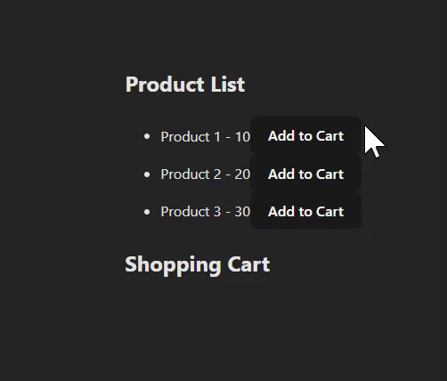

<h1> ReduCart</h1>

Bu proje useReducer hook'unu kullanarak alışveriş sepeti özelliğini yönetmeyi göstermektedir.

<h2> Proje Yapısı </h2>

<ul>

<li>Components: Uygulamanın bileşenlerini içeren klasördür.

<li>ProductList.js: Ürünleri listeleyen ve sepete ekleyen bileşen.<li>
<li>ShoppingCart.js: Sepeti gösteren ve ürünleri çıkaran bileşen.<li>

<li>

<li>Reducers: useReducer hook'u ile kullanılan özel reducer'ı içeren klasör.

<li>cartReducers.js:  Alışveriş sepeti state'ini yöneten reducer.<li>

<li>

<ul>

<h2>Ekran Görüntüsü</h2>

